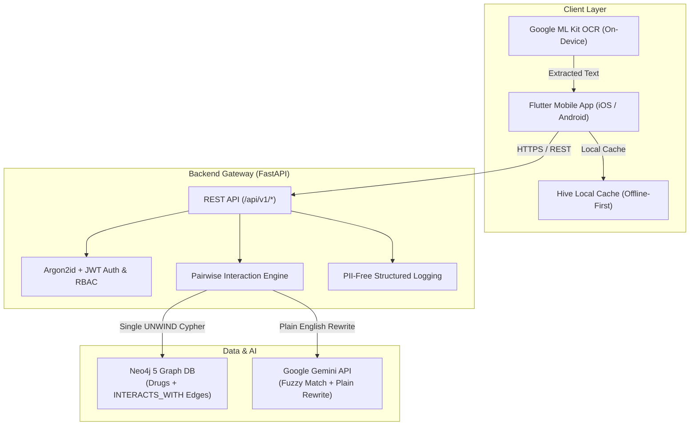

# CascadeX

> **CascadeX** is an intelligent, patient-facing medication safety and drug-to-drug interaction (DDI) alert platform. It tracks prescriptions, identifies severe contraindications across complex drug regimens using a graph database, and explains risks in plain, accessible language for elderly patients and caregivers.

**⚠️ Medical Disclaimer:** CascadeX is a course demonstration and educational prototype, not a certified medical device (SaMD). It does not replace clinical consultation with a licensed pharmacist or physician.

---

## Key Features

- 🔍 **Real-Time Pairwise Interaction Engine:** Detects severe, moderate, and minor drug-drug interactions modeled as graph traversals in Neo4j with sub-15ms p95 latency.
- 📸 **On-Device Label OCR:** Captures prescription label text using Google ML Kit Text Recognition with on-device privacy (no raw photos sent to cloud).
- 🤖 **Constrained AI Language Layer:** Uses Google Gemini API strictly for fuzzy catalog matching and translating medical mechanisms into 8th-grade reading level explanations without clinical hallucinations.
- 🛡️ **Field-Level Encryption & Zero PII Logs:** Encrypts sensitive raw OCR text at rest with Fernet (AES-128-CBC) and enforces structured request logging strictly stripped of medication and patient names.
- ♿ **Elderly-First Accessible Frontend:** Built with Flutter (Material 3 + Riverpod), supporting offline-first caching via Hive, 48×48dp tap targets, and high-contrast WCAG AA tiered alert visuals.
- 📄 **Clinical PDF Export:** Generates downloadable, structured medication logs and interaction histories using ReportLab.

---

## Tech Stack

| Layer | Technology | Key Capabilities |
|---|---|---|
| **Frontend** | Flutter (Dart) + Riverpod + Hive | Android & iOS, offline caching, accessible theme |
| **Backend API** | FastAPI (Python 3.11) | Async REST API, OpenAPI docs at `/docs`, versioned `/api/v1/` |
| **Graph Database** | Neo4j 5 | Graph-based interaction modeling, single-query Cypher `UNWIND` |
| **Interaction Data** | DDInter 2.0 Academic Dataset | Standardized DDI dataset imported via idempotent seeder |
| **Authentication** | Argon2id + JWT | Short-lived access tokens, rotating refresh tokens |
| **On-Device OCR** | Google ML Kit | Offline text extraction from pill bottles |
| **AI Assist** | Google Gemini 1.5 Flash | Fuzzy name matching & plain-language rewrite |
| **Security & Crypto** | Cryptography (Fernet) + slowapi | Field encryption at rest, rate limiting, CORS allow-list |
| **CI / CD** | GitHub Actions + Dependabot | Pytest suite, pip-audit CVE gate, flutter analyze/test |

---

## Architecture & System Overview



---

## Quickstart & Local Deployment

### Prerequisites
- [Docker Desktop](https://www.docker.com/products/docker-desktop/) (Docker Compose v2+)
- [Flutter SDK](https://flutter.dev/docs/get-started/install) (stable channel, optional for mobile client)
- Python 3.11+ (optional for local non-containerized dev)

---

### Step 1: Clone and Configure Environment

```bash
git clone <repo-url>
cd cascadex

# Copy environment template
cp backend/.env.example backend/.env
```

*(Optional)* To enable Gemini AI fuzzy matching and plain-language rewrites, add your API key to `backend/.env`:
```env
GEMINI_API_KEY=your_gemini_api_key_here
```

---

### Step 2: Start Backend & Neo4j with Docker

```bash
# Start backend and Neo4j services in detached mode
docker compose up -d
```

---

### Step 3: Seed the Drug Interaction Database (One-Shot)

```bash
# Seed DDInter 2.0 catalog & interaction edges into Neo4j
docker compose --profile seed up seeder
```

---

### Step 4: Verify System Health

```bash
curl http://localhost:8000/health
```

Expected response:
```json
{
  "status": "ok",
  "neo4j": "connected",
  "app_version": "1.0.0",
  "drug_count": 32,
  "llm_mode": "active",
  "dataset_version": "ddinter-fixture-v1"
}
```

- **Interactive API Docs (Swagger):** [http://localhost:8000/docs](http://localhost:8000/docs)
- **ReDoc Documentation:** [http://localhost:8000/redoc](http://localhost:8000/redoc)
- **Neo4j Browser:** [http://localhost:7474](http://localhost:7474) (User: `neo4j` / Password: `password`)

---

### Step 5: Run the Flutter Mobile App

```bash
cd frontend
flutter pub get
flutter run
```

---

## Testing & Quality Assurance

### Run Backend Test Suite (Unit, Security, Performance & Integration)

```bash
cd backend
pip install -r requirements.txt
pytest --tb=short -q
```

Included Test Suites:
- `test_interaction_engine_core.py`: Validates deterministic interaction edge resolution.
- `test_interaction_engine_unmatched.py`: Enforces the "Unmatched ≠ Safe" invariant (NFR-4).
- `test_security_headers_cors.py`: Validates CORS allow-list enforcement without wildcard `*`.
- `test_encryption_at_rest.py`: Verifies Fernet AES-128 encryption/decryption for sensitive OCR fields.
- `test_logging_no_pii.py`: Ensures zero patient or medication names leak into log streams.
- `perf/test_interaction_engine_perf.py`: Benchmark enforcing NFR-3 budget (p95 ≤ 500ms over 20 drugs / 190 pairs).

### Run Frontend Widget & Unit Tests

```bash
cd frontend
flutter test
```

---

## Documentation Directory

| Document | Description |
|---|---|
| [`docs/ARCHITECTURE.md`](docs/ARCHITECTURE.md) | In-depth system architecture, component contracts, and data flows |
| [`docs/DEMO_SCRIPT.md`](docs/DEMO_SCRIPT.md) | Numbered 13-step walkthrough script for graders and evaluators |
| [`docs/SECURITY.md`](docs/SECURITY.md) | Comprehensive security controls, threat mitigations, and compliance boundaries |
| [`docs/RESUME_SUMMARY.md`](docs/RESUME_SUMMARY.md) | Outcome-driven resume bullets and deep-dive interview talking points |
| [`docs/PROJECT_OVERVIEW.md`](docs/PROJECT_OVERVIEW.md) | Full product specifications, user personas, and data contracts |
| [`docs/SRS.md`](docs/SRS.md) | Formal Software Requirements Specification (Functional & Non-Functional) |

---

## Build Phases Summary

| Phase | Milestone | Status |
|---|---|---|
| **Phase 01** | Infrastructure, Docker Compose, CI, FastAPI Skeleton | ✅ Complete |
| **Phase 02** | DDInter 2.0 Ingestion, Neo4j Graph Schema & Drug Normalizer | ✅ Complete |
| **Phase 03** | Argon2id Auth, JWT Refresh Tokens & Caregiver RBAC | ✅ Complete |
| **Phase 04** | Medication Entry CRUD, Catalog Search & Dose Logging | ✅ Complete |
| **Phase 05** | ML Kit OCR Pipeline & Two-Stage Drug Name Resolution | ✅ Complete |
| **Phase 06** | Pairwise Interaction Engine & Unmatched Safety Invariants | ✅ Complete |
| **Phase 07** | Tiered Alert Fatigue Management & Dose Reminders | ✅ Complete |
| **Phase 08** | Flutter Accessible UI (WCAG AA), PDF Export & Offline Sync | ✅ Complete |
| **Phase 09** | Security Hardening, Fernet Encryption, NFR-3 Perf & Docs | ✅ Complete |

---

## Academic Information

- **Course:** BCSE301L – Software Engineering
- **Interaction Data Source:** DDInter 2.0 (Academic Drug-Drug Interaction Dataset)
- **Terminology Standards:** RxNorm & ATC Classification
