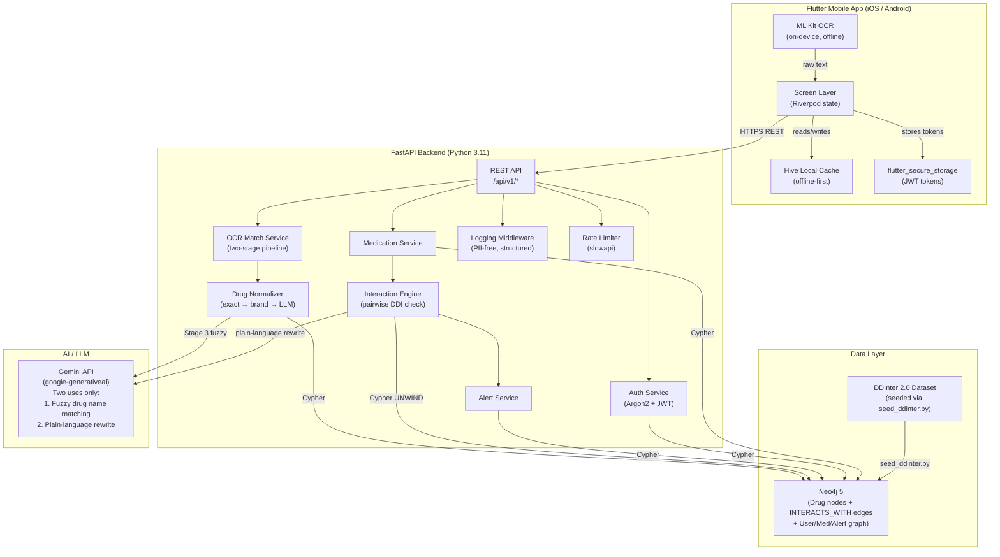

# CascadeX — Architecture

> **Phase 09 doc.** This describes what was actually built, not aspirational design.

---

## System Overview

CascadeX is a drug-drug interaction (DDI) warning system for elderly or multi-medicated users and their caregivers. The system consists of an on-device Flutter mobile client and a backend API server, with no third-party cloud services touching patient medication data except the Gemini LLM — used only for text normalization, not clinical decisions.

---

## Component Diagram



---

## Component Table

| Component | Technology | Key Design Decisions |
|---|---|---|
| Mobile frontend | Flutter (Dart, stable) | Single codebase Android + iOS. Riverpod for state. |
| Local state | Riverpod providers | Minimal boilerplate; scoped providers per screen |
| Offline cache | Hive | Medication list + alerts cached locally; offline-safe reads |
| Token storage | flutter_secure_storage | JWT stored in OS keychain, never SharedPreferences |
| On-device OCR | Google ML Kit Text Recognition | No cloud OCR calls; works fully offline |
| Backend API | FastAPI (Python 3.11) | Async, auto OpenAPI docs at `/docs`; versioned `/api/v1/` |
| Auth | JWT (access 15min + refresh 7d) + Argon2id | Short-lived tokens; refresh rotation; Argon2id over bcrypt |
| Primary DB | Neo4j 5 (graph) | Drugs/interactions modeled as nodes + `INTERACTS_WITH` edges; natural fit for pairwise traversal |
| Interaction dataset | DDInter 2.0 | Open academic dataset; imported via versioned `seed_ddinter.py` job (idempotent MERGE) |
| Drug name normalization | `drug_normalizer.py` | Exact generic → exact brand → LLM fuzzy match cascade |
| Interaction engine | `interaction_engine.py` | Single `UNWIND` Cypher round-trip for all pairs; LLM rewrite happens **after** edge list is final (safety invariant) |
| LLM | Google Gemini (`gemini-1.5-flash`) | Two narrow uses only: fuzzy name matching + plain-language rewrite. Never originates or infers interactions. |
| Field encryption | `cryptography.fernet` | Symmetric Fernet key; applied to `ScanRecord.ocr_text` before Neo4j write |
| Logging | Custom `LoggingMiddleware` | Logs method, path, status, latency, user_id; never logs drug names, email, or request bodies |
| Rate limiting | slowapi | 10 req/min on auth endpoints in production; disabled in test |
| CORS | FastAPI CORSMiddleware | Explicit allow-list from `ALLOWED_ORIGINS` env var; never `*` |
| CI/CD | GitHub Actions | Lint (ruff), pytest + Neo4j service container, flutter analyze + test, pip-audit |
| Dependency scanning | Dependabot + pip-audit | Weekly pip/pub updates; pip-audit fails CI on known CVEs |
| Containerization | Docker Compose | `docker compose up` starts backend + Neo4j; `--profile seed` also seeds DDInter data |

---

## Data Flow: Interaction Check

```
User opens Medications screen
  → GET /api/v1/medications (Riverpod fetch)
  → GET /api/v1/medications/interactions
      → interaction_engine.check_pairs(drug_ids)
          → Single Cypher UNWIND (all pairs, one round-trip)
          → For each edge found: plain_language_rewrite(mechanism) via Gemini
      ← InteractionCheckResult { interactions, unmatched_warnings }
  ← Flutter displays severity-colored alert cards
```

## Data Flow: OCR Scan → Add Medication

```
User taps camera icon
  → ML Kit OCR extracts raw text (on-device, offline)
  → POST /api/v1/scans { ocr_text }
      → ocr_match_service.run_ocr_match()
          → Stage 1: drug_normalizer.normalize() (exact generic + brand)
          → Stage 2 (miss only): match_drug_name() via Gemini
          → ScanRecord.ocr_text = encrypt_field(raw_text) → Neo4j
      ← ScanCandidateList { primary_match, candidates }
  → User reviews + taps "Confirm & Add"
  → POST /api/v1/medications/ { drug_id, input_method="scan" }
      → MedicationEntry created → interaction engine re-checked
```

---

## Key Safety Invariants (enforced in code)

1. **Unmatched ≠ Safe**: An unrecognized drug always produces an explicit `UnmatchedDrugWarning` — never a silent "no interactions found."
2. **LLM cannot invent interactions**: `plain_language_rewrite()` is called **after** the Neo4j edge list is finalized. It rewrites text, never determines which pairs interact.
3. **LLM candidate safety gate**: `match_drug_name()` returns only names from the caller-supplied candidate list; any out-of-list LLM response is silently rejected.
4. **PII-free logs**: `LoggingMiddleware` logs only opaque `user_id` values — never names, emails, drug names, or request bodies.
5. **Parameterized Cypher**: All Neo4j queries use parameterized statements — no string concatenation (Cypher injection protection).
